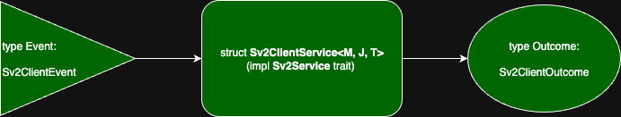
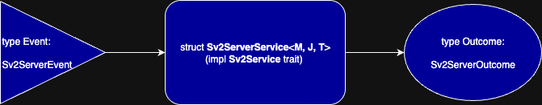

<h1 align="center">
   
  
   
tower-stratum
 
</h1>

🦀 Tower middleware for Bitcoin mining over <a href="https://github.com/stratum-mining/stratum">Stratum V2 Reference Implementation</a> ⛏️

This crate aims to provide a robust middleware API for building Bitcoin mining apps based on:
- [Tower](https://docs.rs/tower/latest/tower/): an asynchronous middleware framework for Rust
- [Tokio](https://tokio.rs/): an asynchronous runtime for Rust
- [Stratum V2 Reference Implementation](https://github.com/stratum-mining/stratum): the reference implementation of the Stratum V2 protocol

The goal is to provide a "batteries-included" approach to implement stateful Sv2 applications.

Note: currently development focus is on Stratum V2 (Sv2). While theoretically possible, Sv1 integration is not planned for the near future.

# Scope

`tower-stratum` provides [`tower::Service`](https://docs.rs/tower/latest/tower/trait.Service.html)s for building apps to be executed under `tokio` runtimes.

They can be divided in two categories:
- Client-side (`Sv2ClientService`)
- Server-side (`Sv2ServerService`)

The user is expected to implement handlers for the different Sv2 subprotocols, and use simple high-level APIs to compose Sv2 applications that are able to exchange Sv2 messages and behave according to the handler.

## Client-side

`Sv2ClientService<M, J, T>` is a `tower::Service` representing a Sv2 Client.

It's able to establish a TCP connection with the Server and exchange `SetupConnection` messages to negotiate the Sv2 Connection parameters according to the user configurations.

Noise encryption over the TCP connections is optional.

It listens for messages from the server, generating `type Request = RequestToSv2Client` for a `Service::call`, which triggers execution of the different subprotocol handlers (implemented by the user) and returns some `type Response = ResponseFromSv2Client`.

The user is expected to set the different generic parameters `<M, J, T>` with implementations for the handler traits of the different subprotocols:
- `M` must implement `trait Sv2MiningClientHandler`
  - example use-cases:
    - Sv2 CPU miner
    - Sv2 Proxy
- `J` must implement `trait Sv2JobDeclarationClientHandler`
  - example use-cases:
    - Sv2 Job Declarator Client
- `T` must implement `trait Sv2TemplateDistributionClientHandler`
  - example use-cases:
    - Sv2 Pool
    - Sv2 Job Declarator Client
    - Sv2 Solo Mining Server

For the subprotocols that are not supported, Null handler implementations are provided:
- `NullSv2MiningClientHandler`
- `NullSv2JobDeclarationClientHandler`
- `NullSv2TemplateDistributionClientHandler`

Whenever `Sv2ClientService<M, J, T>` is loaded with one of these Null handler implementations, the service will NOT support such subprotocol.

## Server-side

`Sv2ServerService<M, J, T>` is a `tower::Service` representing a Sv2 Server.

It's able to listen for TCP connections and exchange `SetupConnection` messages to negotiate the Sv2 Connection parameters according to the user configurations.

Noise encryption over the TCP connections is optional.

It listens for messages from multiple clients, generating `type Request = RequestToSv2Server` for a `Service::call`, which triggers execution of the different subprotocol handlers (implemented by the user) and returns some `type Response = ResponseFromSv2Server`.

Inactive clients have their connections killed and are removed from memory after some predefined time.

The user is expected to set the different generic parameters `<M, J, T>` with implementations for the handler traits of the different subprotocols:
- `M` must implement `trait Sv2MiningServerHandler`
  - example use-cases:
    - Sv2 Proxy
    - Sv2 Pool
    - Sv2 Solo Mining Server
- `J` must implement `trait Sv2JobDeclarationServerHandler`
  - example use-cases:
    - Sv2 Job Declarator Server
- `T` must implement `trait Sv2TemplateDistributionServerHandler`
  - example use-cases:
    - Sv2 Template Provider

For the subprotocols that are not supported, Null handler implementations are provided:
- `NullSv2MiningServerHandler`
- `NullSv2JobDeclarationServerHandler`
- `NullSv2TemplateDistributionServerHandler`

Whenever `Sv2ServiceService<M, J, T>` is loaded with one of these Null handler implementations, the service will NOT support such subprotocol.

# Licence

[`MIT`](LICENSE)